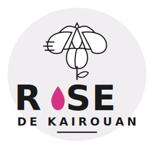

<div align="center">



# 🌹 Gestion Rose de Kairouan

**Application web de gestion agricole pour la culture de la Rose de Kairouan — Tunisie**

[](https://github.com/bilel86/gestion-rose-kairouan/releases/tag/v1.01)
[](https://www.python.org/)
[](https://www.djangoproject.com/)
[](https://getbootstrap.com/)
[](LICENSE)

</div>

---

## 📋 Présentation

**Gestion Rose de Kairouan** est une application web Django dédiée à la gestion complète d'une exploitation agricole spécialisée dans la culture de la rose à **Kairouan, Tunisie**.

Elle couvre l'ensemble du cycle d'exploitation : des terrains à la récolte, des employés aux ventes, avec un tableau de bord centralisé et des graphiques analytiques.

---

## ✨ Fonctionnalités

| Module | Description |
|---|---|
| 📊 **Dashboard** | KPIs en temps réel, synthèse financière, graphiques Chart.js |
| 🌍 **Terrain** | Gestion des parcelles — exploitation de 7 Ha |
| 👷 **Employés** | Fiches employés, pointage journalier, calcul des salaires |
| 🌸 **Récolte** | Suivi quotidien de la production de roses |
| 💰 **Ventes** | Enregistrement et historique des ventes |
| 🧾 **Charges** | Suivi des coûts et dépenses d'exploitation |
| 📈 **Graphiques** | Analyses visuelles de production et revenus |
| 🌐 **Bilingue** | Interface disponible en **Français** et **English** |

---

## 🖥️ Aperçu

### Palette de couleurs

| Couleur | Hex | Usage |
|---|---|---|
| Rose Magenta | `#D63384` | Couleur principale (logo) |
| Rose Sombre | `#A8256A` | Hover / accents |
| Rose Clair | `#FCE4EC` | Fonds / sidebar active |
| Noir | `#1A1A1A` | Texte / navbar |

---

## 🛠️ Stack technique

- **Backend** — Python 3.14 / Django 6.0
- **Base de données** — SQLite (développement)
- **Frontend** — Bootstrap 5.3, Chart.js 4.4, Bootstrap Icons
- **Polices** — Google Fonts (Nunito)
- **Fichiers statiques** — WhiteNoise

---

## 🚀 Installation & Lancement

### Prérequis

- Python 3.10+
- pip

### Étapes

```bash
# 1. Cloner le dépôt
git clone https://github.com/bilel86/gestion-rose-kairouan.git
cd gestion-rose-kairouan

# 2. Créer un environnement virtuel
python -m venv venv
venv\Scripts\activate        # Windows
# source venv/bin/activate   # Linux / macOS

# 3. Installer les dépendances
pip install django whitenoise

# 4. Appliquer les migrations
python manage.py migrate

# 5. Lancer le serveur
python manage.py runserver
```

Ouvrir dans le navigateur : **http://127.0.0.1:8000**

---

## 📁 Structure du projet

```
gestion_rose/
├── couts/              # Module charges / dépenses
├── dashboard/          # Tableau de bord & graphiques
├── employes/           # Gestion des employés
├── production/         # Suivi de la récolte
├── terrain/            # Gestion des parcelles
├── ventes/             # Module ventes
├── gestion_rose/       # Configuration Django
├── templates/          # Templates HTML (base.html + modules)
├── static/
│   └── images/
│       └── logo.svg    # Logo Rose de Kairouan
└── manage.py
```

---

## 🌍 Internationalisation

L'application supporte deux langues, sélectionnables depuis la navbar :

- 🇫🇷 **Français** (langue par défaut)
- 🇬🇧 **English**

---

## 📌 Versions

| Version | Date | Description |
|---|---|---|
| **v1.01** | Mai 2026 | Première version officielle — tous modules actifs |

---

## 👤 Auteur

**Bilel Jaouadi**
- GitHub : [@bilel86](https://github.com/bilel86)
- Email : bileljaouadi86@gmail.com
- Localisation : Kairouan, Tunisie 🇹🇳

---

## 📄 Licence

Ce projet est sous licence **MIT** — libre d'utilisation et de modification.

---

<div align="center">
  <sub>Fait avec ❤️ pour la Rose de Kairouan 🌹</sub>
</div>
